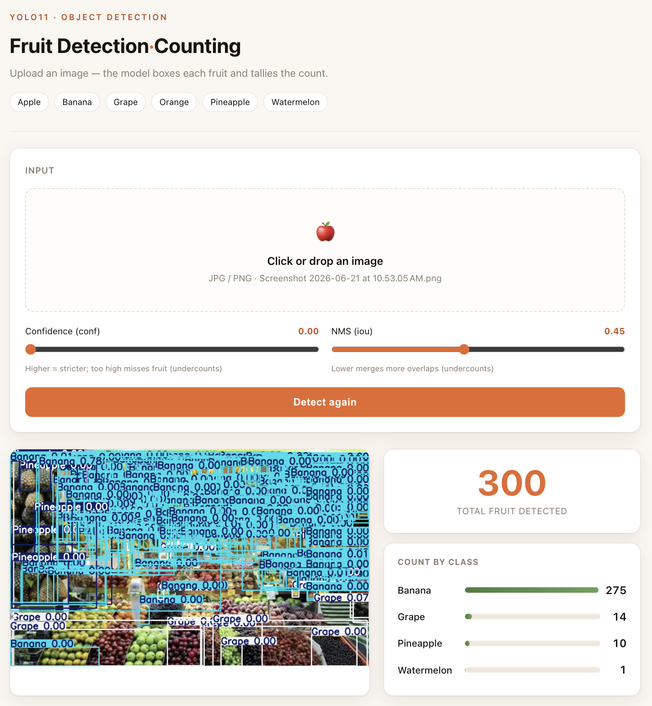

# Fruit Detection & Counting

A hands-on object detection project: train a [Ultralytics YOLO11](https://github.com/ultralytics/ultralytics) model to detect and count six kinds of fruit, then serve it locally through a FastAPI app with a clean web interface.

Everything runs locally — no Docker, no cloud, no API keys.

---

## Features

- **One-command dataset download** — public dataset pulled straight from GitHub, no Roboflow/Kaggle account needed
- **Training** on Apple Silicon (MPS) or CPU with YOLO11
- **Evaluation** with mAP metrics and a `conf`/`iou` sweep to understand counting behavior
- **Web UI** — drag-and-drop an image, tune thresholds live, see boxed results and per-class counts
- **REST API** via FastAPI (`/detect`) with auto-generated Swagger docs

---

## Demo

Upload an image, adjust the confidence and NMS thresholds, and view the annotated result alongside a per-class count — all in the browser at `http://localhost:8000/`.



---

## Dataset

[lightly-ai/dataset_fruits_detection](https://github.com/lightly-ai/dataset_fruits_detection) (originally from Kaggle, by Lakshay Tyagi).

- **6 classes:** Apple, Banana, Grape, Orange, Pineapple, Watermelon
- **8,479 images** — train 7,108 / valid 914 / test 457
- Already in YOLO format, 640×640, with `data.yaml` included

---

## Project structure

```
fruit/
├── data/
│   └── data.yaml        # dataset config (auto-generated by download_data.py)
├── download_data.py     # one-command dataset download
├── train.py             # training
├── evaluate.py          # metrics + conf/iou sweep
├── inference.py         # detection + counting logic
├── app.py               # FastAPI server
├── index.html           # web interface
├── requirements.txt
└── README.md
```

---

## Quickstart

### 1. Set up the environment

```bash
conda create -n fruit python=3.11 -y
conda activate fruit
pip install -r requirements.txt
```

### 2. Download the dataset

```bash
python download_data.py
```

Clones the dataset from GitHub and writes a matching `data/data.yaml`. No account or API key required.

### 3. Train

```bash
python train.py
```

Defaults to `yolo11n` (nano) on the MPS backend. Adjust `batch`, `epochs`, or `device` in `train.py` as needed. Weights are saved under `runs/`.

> **Apple Silicon note:** the PyTorch MPS backend can occasionally crash mid-training with a tensor-size/index error on dense batches. If that happens, resume from the last checkpoint:
> ```python
> from ultralytics import YOLO
> YOLO("runs/detect/runs/fruit_v1/weights/last.pt").train(resume=True)
> ```
> Or set `device="cpu"` for a slower but fully stable run.

### 4. Evaluate

```bash
python evaluate.py
```

Prints test-set mAP and saves annotated predictions. Uncomment the `conf_iou_sweep(...)` call to see how the detection count changes across thresholds.

### 5. Run the web app

```bash
uvicorn app:app --reload
```

Then open:

- **`http://localhost:8000/`** — web interface
- **`http://localhost:8000/docs`** — Swagger API docs

---

## API

| Method | Endpoint | Description |
|--------|----------|-------------|
| `GET`  | `/`        | Web interface |
| `GET`  | `/health`  | Health check |
| `GET`  | `/info`    | Model classes |
| `POST` | `/detect`  | Upload an image, returns counts + annotated image |

`POST /detect` accepts an image file plus optional `conf` and `iou` query params, and returns:

```json
{
  "total": 7,
  "by_class": { "Watermelon": 7 },
  "detections": [
    { "label": "Watermelon", "conf": 0.87, "bbox": [120.0, 80.0, 230.0, 175.0] }
  ],
  "image_base64": "..."
}
```

---

## Results

Trained `yolo11n` for 50 epochs at 640x640 on Apple Silicon. Validation set (3,227 instances across 914 images):

| Class | mAP@50 |
|-------|:------:|
| Watermelon | 0.65 |
| Banana | 0.53 |
| Apple | 0.51 |
| Pineapple | 0.48 |
| Grape | 0.41 |
| Orange | 0.40 |
| **All** | **0.50** |

Large, sparse fruit (watermelon) scores highest; small, dense, overlapping classes (grape, orange) are the hardest — the classic small-object detection challenge.

### Ideas to improve

- Use a larger model (`yolo11s` / `yolo11m`)
- Train longer (100+ epochs)
- Increase input size (`imgsz=960`) to help small objects

---

## Understanding `conf` and `iou`

The two thresholds in the web UI directly control the count:

- **`conf` (confidence)** — minimum score to keep a box. Higher is stricter; too high misses fruit and **undercounts**. Too low adds false positives and **overcounts**.
- **`iou` (NMS)** — how much two boxes must overlap to be merged as the same object. Too low merges adjacent fruit and **undercounts**; too high leaves duplicate boxes and **overcounts**.

Dense fruit (grape clusters, piled oranges) is especially sensitive to these — tuning them is the core of getting an accurate count.

---

## Tech stack

- [Ultralytics YOLO11](https://github.com/ultralytics/ultralytics) — detection model
- [FastAPI](https://fastapi.tiangolo.com/) + [Uvicorn](https://www.uvicorn.org/) — API server
- [PyTorch](https://pytorch.org/) (MPS / CPU) — training backend
- Vanilla HTML/CSS/JS — web interface

---

## License

Released under the MIT License. The dataset is redistributed from its original source under its own terms; see the [dataset repository](https://github.com/lightly-ai/dataset_fruits_detection) for details.
